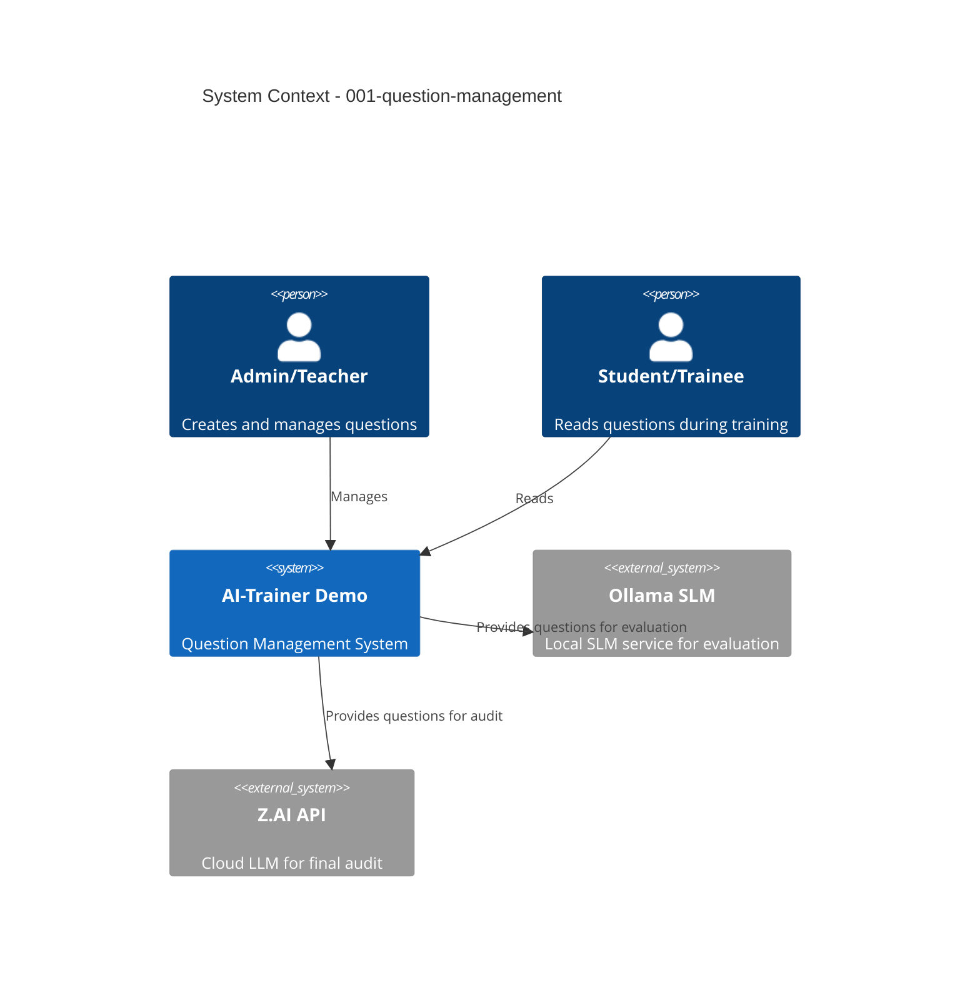

# 001-question-management - System Context

## System Overview

The Question Management subsystem is a core component of the AI-Trainer Demo application. It serves as the foundational content source, enabling administrators and teachers to import, store, organize, and manage question-answer pairs from podcast transcripts. These questions are consumed by the SLM (Small Language Model) for initial user answer evaluation and by the LLM (Large Language Model) for final performance audits.

The subsystem provides CRUD operations, category management, and import/export functionality, acting as a bridge between content creation (admin/teachers) and AI evaluation systems.

## Context Diagram

## Actors

- **Admin/Teacher** (Human): Primary user who creates, imports, edits, organizes, and manages questions. Has full CRUD permissions and can import/export question data.

- **Student/Trainee** (Human): End user who views questions during training sessions. Has read-only access to questions and answers them for evaluation.

## External Systems

- **Ollama SLM**: Local Small Language Model service (gemma3:8b) that receives question data to evaluate user answers. Direction: Question Management → Ollama (outbound). Risk: Low - local service.

- **Z.AI API (GLM-5)**: Cloud Large Language Model API that receives question data for final audit of SLM performance. Direction: Question Management → Z.AI API (outbound). Risk: Medium - external service requires network connectivity and API key management.

- **CSV/JSON Import Files**: External data sources (podcast transcripts) containing question-answer pairs. Direction: Files → Question Management (inbound). Risk: Low - local file operations, validation required.

- **Angular Frontend**: Web application UI that consumes the Question Management API for all operations. Direction: Bidirectional (API serves frontend, frontend sends requests). Risk: None - internal system component.

## Data Flows

### Inbound

- **Admin/Teacher Input**: Question data (text, reference answer, category) entered via Angular UI forms and sent to Question Management API.

- **File Import**: CSV or JSON files uploaded via Angular UI, parsed by backend, and validated before storage in SQLite database.

### Outbound

- **SLM Query**: Questions and reference answers retrieved from database and sent to Ollama SLM for answer evaluation during training sessions.

- **LLM Audit**: Question and evaluation data sent to Z.AI API for final performance audit and quality review.

- **Export Output**: Questions and metadata exported to CSV or JSON files for backup and sharing purposes.

### Internal

- **Database Storage**: Questions stored in SQLite database with metadata (created_at, updated_at, category) and relationships to evaluations and audits.

## High-Level Constraints

- Questions must be imported/created before they can be used in SLM evaluations or LLM audits.
- Category management must maintain referential integrity (questions with invalid categories are not stored).
- Import/export must support round-trip compatibility (same format for both operations).
- SQLite database is used for demo purposes; migration strategy may be needed for production-scale deployments.

## Key NFR Goals

- **Import Performance**: Process 1000 questions in < 5 seconds
- **Response Time**: Question CRUD operations < 100ms (p95), list queries < 200ms
- **Data Integrity**: 99%+ import accuracy, no orphaned category references
- **Scalability**: Support 10,000+ questions in SQLite, handle 10+ concurrent admin users
- **Security**: Validate all inputs, prevent XSS, enforce role-based access (admin/teachers full CRUD, students read-only)
